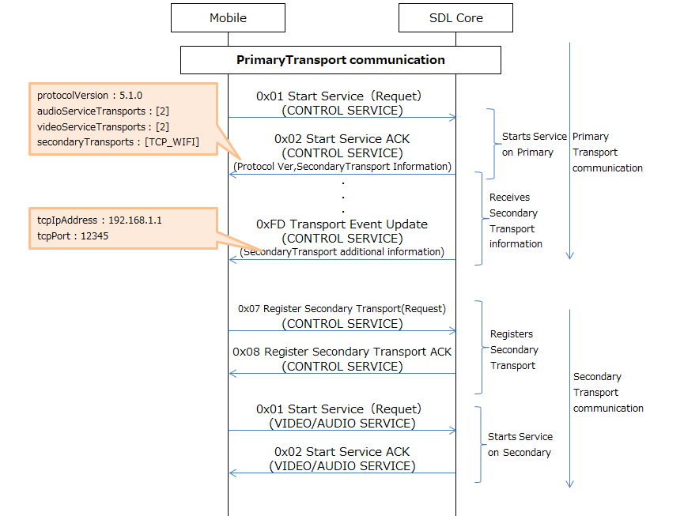

# 4.2.WiFi Connection

## 1. Overview
This chapter describes about WiFi connection.

## 2. Background/Purpose/Reason for Standardization
Currently, there is no explicit summary regarding SecondaryTransport connection including WiFi,  because it is still under proposal in the SDL Evolution.
Therefore, the purpose of this document is to summarize the proposal and standardize the issue, in order to be able to contribute to the SDL Ecosystem.

## 3. Function Details
### 3.1. Function overview
WiFi connection does not communicate using PrimaryTransport, rather it is registered as one of the communication method of SecondaryTransport.
If both Primary and Secondary connection were enabled, each will have the following roles.

 -PrimaryTransport : It will be used for the communication of RPC.
 -SecondaryTransport : It will be used for the communication of Data service such as Video streaming/Audio streaming.

WiFi connection will be established between the SDL App and the HU by following the SmartDeviceLink protocol specification (<https://www.smartdevicelink.com/en/guides/sdl-overview-guides/protocol-spec/>). Then, it will be registered as SecondaryTransport.

!!! NOTE
Due to the limitation of iOS specification, WiFi connection will be disabled when the SDL App goes "BACKGROUND" or the mobile screen is locked.
Therefore, WiFi can not be connected as a PrimaryTransport.
!!!

### 3.2. Connection Method
The communication on SecondaryTransport follows the SmartDeviceLink protocol specification.
Below is a list of control frame that is used for SecondaryTransport connection.

**Table1.** Control Frame list

|
 No. 
|
 Frame  value 
|
 Frame 
|
 Description 
|
|:---:|:---:|:---|:---|
|
 1 
|
 0x01 
| Start Service | Requests to start specific (type of) service. |
|
 2 
|
 0x02 
| Start Service ACK | Notifies that Start Service has started successfully. `Strat Service ACK` of PrimariyTransport has the information of SecondaryTransport. When the SDL App establish SecondaryTransport session, this informaton will be refered. The information on protocol version is attributed in this frame. |
|
 3 
|
 0x03 
| Start Service NAK | Notifies that Start Service has failed. |
|
 4 
|
 0x07 
| Register Secondary Transport | Request a session that is registered on the PrimaryTransport to use SecondaryTransport. This frame is sent from the proxy to the SDL Core. This frame must only be sent on SecondaryTransport that the session is requesting. |
|
 5 
|
 0x08 
| Register Secondary Transport ACK | Notifies that the session registered to use the requested SecondaryTransport. If the SDL App received this frame, it can send the additional frame on SecondaryTransport. This frame must be sent on the SecondaryTransport, in which the original request is sent(`Register SecondaryTransport`). |
|
 6 
|
 0x09 
| Register Secondary Transport NAK | Notifies that the session is not registered or not able to use the current SecondaryTransport. The SDL App cannot use this SecondaryTransport for other messages. This frame must be sent on the SecondaryTransport, in which the original request is sent(`Register SecondaryTransport`). |
|
 7 
|
 0xFD 
| Transport Event Update | Shows the updated information on more than one transport and is sent from the SDL Core to the Proxy. Information such as the TCPIP Address/the TCP Port are sent. Note that this frame should NOT be sent before the SmartDeviceLink Protcol version is determined. |

Next, listed below are the parameter set in the control frame.
About the parameter setting, please refer to the `smartDeviceLink.ini` file in the SDL Core.

**Table2.** Parameters set in Control frame

|
 No. 
|
 Parameter 
|
 Description 
|
|:---:|:---|:---|
|
 1 
| protocolVersion | Parameter of `Start Service ACK` frame. Shows the version of SmartDeviceLink Protocol specification (Ex. "5.0.0"). The newest version of SmartDeviceLink Protocol specification is needed to create the SDL App. |
|
 2 
| secondaryTransports[] | Parameter of `Start Service ACK` frame. Shows transport type which supports as SecondaryTransport. The proxy starts to set up SecondaryTransport, when Transport Type is notified. If there is no supported Transport Type, the array should be omitted or emptied. Please refer to table3 for the kinds of Transport Type. |
|
 3 
| audioServiceTransports | Parameter of `Start Service ACK` frame. Shows transports which support transport path for the Audio service. The type is int32 with each of the following meaning below:   1 : Audio service is available on PrimaryTransport.  2 : Audio service is available on SecondaryTransport.  If both Transports (Primary/Secondary) support the Audio service, then it should be in prioritize order and the SDL core will decide which transport will be used. If `Start Service ACK` is for SecondaryTransport, this parameter should not be included. If this parameter is not included in `StartServiceACK` frame, the SDL App must launch the Audio service on PrimaryTransport. |
|
 4 
| videoServiceTransports | Parameter of `Start Service ACK` frame. Shows transports which support transport path for the Video Projection Mode (VPM) service. The type is int32 with each of the following meaning below:   1 : VPM service is available on PrimaryTransport.  2 : VPM service is available on SecondaryTransport.  If both Transports (Primary/Secondary) support the VPM service, then it should be in prioritize order and the SDL core will decide which transport will be used. SDL App must not launch transport that is not listed in the array. If this parameter is not included in `StartServiceACK` frame, the SDL App must launch the VPM service on PrimaryTransport. |
|
 5 
| tcpIpAddress | Parameter of `Transport Event Update` frame. Shows the IP Address used to establish a TCP connection. It can be (set as) either IPv4 Address(ex: "192.168.1.1") or IPv6 Address(ex: "fd12:3456:789a::1"). If IP address is blank, it indicates that the TCP transport cannot be used. |
|
 6 
| tcpPort | Parameter of `Transport Event Update` frame. Shows TCP port numbers used to establish a connection using tcpIpAddress. The value must be the same as TCPAdapterPort in the smartDeviceLink.ini file. If this parameter is set, then the value of tcpIpAddress must be included as well. |

!!! NOTE
[] indicates the array type, and able for multiple settings.
!!!

Listed below are Transport Type strings used in the parameter of SecondaryTransport.

**Table3.** TransportType strings list set on SecondaryTransports

|
 No. 
|
 TransportType string 
|
 Description 
|
|:---:|:---|:---|
|
 1 
| IAP_BLUETOOTH | iPhone Accessary Protocol(iAP) via Bluetooth |
|
 2 
| IAP_USB | iAP via USB, cannot distinguish between the Host mode and the Device mode |
|
 3 
| IAP_USB_HOST_MODE | iAP via USB, mobile is running as the Host |
|
 4 
| IAP_USB_DEVICE_MODE | iAP via USB, mobile is running as the Device |
|
 5 
| IAP_CARPLAY | iAP via CarPlay wireless |
|
 6 
| SPP_BLUETOOTH | Blutooth Serial Port Profile(SPP) |
|
 7 
| AOA_USB | Android Open Accessary(AOA) |
|
 8 
| TCP_WIFI | TCP connection via WiFi |

### 3.3. Conditions for SecondaryTransport Connection
Using SecondaryTransport connection has the following conditions below:

 - `Transport Event Update` and `Register Secondary Transport` are not sent before the detarmination of SmartDeviceLink protocol version.
 - If PrimaryTransport is disconnected, then SecondaryTransport is stopped too.
 - `Register Secondary Transport` frame is sent after all of the information of SecondaryTransport configuration is determined.
 - (To avoid interference with each other) using WiFi in 5GHz frequency band is recommended, because Bluetooth runs in a 2.4Ghz frequency band.
 - There is no means to terminate SecondaryTransport connection.

### 3.4. WiFi Connection
Listed below are the necessary information (parameter) for WiFi connection.
By setting all of the information, WiFi connection can be used as SecondaryTransport.
For the sequence of WiFi connection, refer to "4. Sequence Diagrams".
Note that WiFi connection cannot be set when the DriverDistraction is ON. Thus, it is set during parking.

**Table4.** WiFi setting Parameter

|
 No. 
|
 Parameter 
|
 Description 
|
|:---:|:---|:---|
|
 1 
| supportWiFiAutoConnect | Indicates whether the automatic WiFi connection is supported or not, as the parameter of struct `DeviceInfo`.   True : Supported  False : Not supported |
|
 2 
| WiFiStateInfo | Shows WiFi Status as the parameter of RPC`GetWiFiStatusInfo(Response)`.   WIFI_STATE_DISABLED ： WiFi is disabled.  WIFI_STATE_ENABLED ： WiFi is enabled. |
|
 3 
| ssid | Shows the specific name of WiFi AccessPoint(AP) as the parameter of RPC`GetWiFiStatusInfo(Response)`. Max length is 32 characters, and can use half-width alphanumeric characters. |
|
 4 
| password | Shows the password to connect WiFi AP as the parameter of RPC`GetWiFiStatusInfo(Response)`. Max length is 100 characters, and can use half-width alphanumeric(upper/lowercase) and partical symbols characters. |
|
 5 
| WiFiSecurityType | Shows the security method to connect WiFi AP as the parameter of RPC`GetWiFiStatusInfo(Response)`. Listed below are the securityTypes settings that are currently available:   WIFI_SECURITY_NONE : No Security  WIFI_SECURITY_WEP : Uses WEP method security  WIFI_SECURITY_WPA : Uses WPA method security  WIFI_SECURITY_WPA2 : Uses WPA2 method Security |

## 4. Sequence Diagrams
Refer to Figure1 for the sequence of SecondaryTransport connection establishment, and Figure2 for the sequence of WiFi connection.

|||
**Figure1.** Establishment sequence of SecondaryTransport connection

|||
 
 
 
|||
**Figure2.** WiFi connection sequence

|||

## 5. Impacted Platforms
Changes impact the following platform/s:
 - Proxy
 - SDL Core
 - HMI